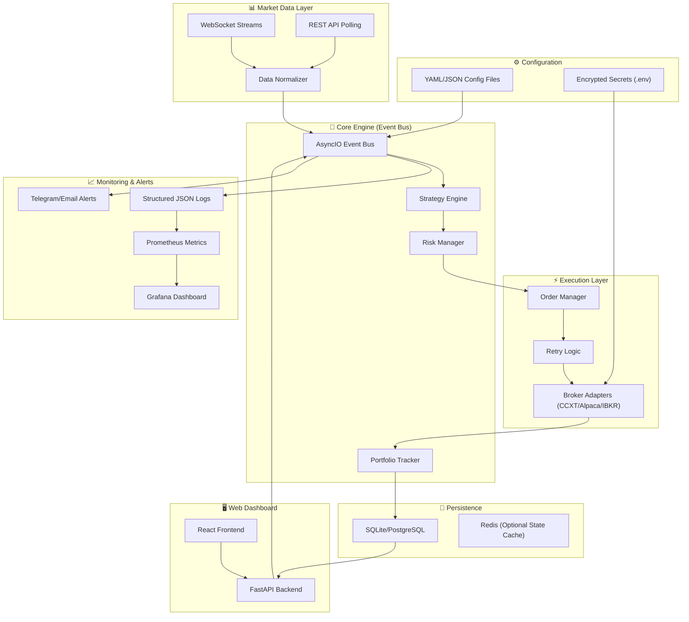
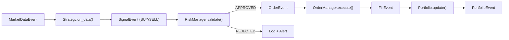
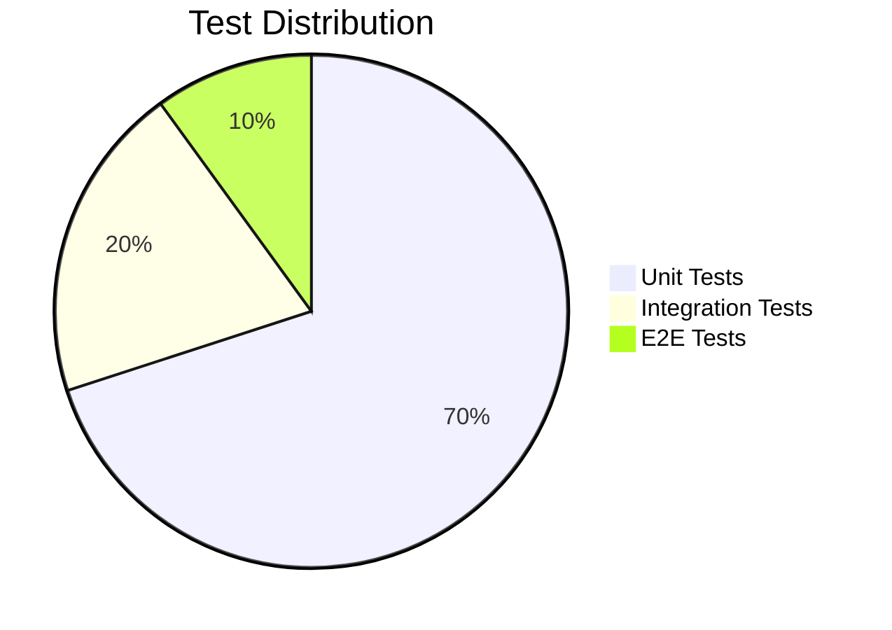

# Autonomous Trading Bot — Implementation Plan

## Overview

Build a **production-level, event-driven, autonomous trading bot** with full CI/CD pipeline (GitHub Actions), comprehensive test coverage (>90%), and modular architecture supporting multiple asset classes and brokers.

---

## 🔴 User Review Required — Critical Questions

Before I write a single line of code, I need clarity on the following. Your answers will fundamentally shape the architecture.

> [!CAUTION]
> ### Q1: What assets will you trade?
> - **Crypto only** → CCXT is sufficient, no broker account needed
> - **US Stocks/ETFs** → Alpaca API (free, developer-friendly, paper trading built-in)
> - **Global multi-asset (Futures, Forex, Options)** → Interactive Brokers (complex but powerful)
> - **Multiple of the above** → We build adapters for each
>
> **My recommendation:** Start with **Alpaca (US Stocks) + CCXT (Crypto)** — both have excellent paper trading and free tiers, which is critical for safe development.

> [!CAUTION]
> ### Q2: Bot vs Web App vs Both?
> You mentioned "not sure which approach is best." Here are the trade-offs:
>
> | Approach | Pros | Cons |
> |----------|------|------|
> | **CLI Bot (Headless)** | Simplest, lowest latency, easiest to deploy 24/7 | No visual interface, config via YAML only |
> | **Bot + Web Dashboard** | Best of both worlds: bot runs autonomously, dashboard for monitoring/control | More code to maintain |
> | **Full Web App** | Beautiful UI, browser-based control | Higher latency, more complex deployment |
>
> **My recommendation:** **Bot + Web Dashboard** — The core trading engine runs as a headless Python process (maximum reliability for 24/7 operation). A lightweight React + FastAPI dashboard provides real-time monitoring, P&L charts, trade history, manual overrides, and configuration management. This is what professional trading shops use.

> [!CAUTION]
> ### Q3: Deployment environment?
> - **Your local machine** (always on, low-cost)
> - **VPS** (DigitalOcean/Hetzner, ~$5-10/mo, reliable uptime)
> - **Docker on any machine** (portable, reproducible)
>
> **My recommendation:** Docker-first design, runnable anywhere. We build Docker Compose for local dev and production.

> [!IMPORTANT]
> ### Q4: Starting capital & risk tolerance?
> This affects position sizing defaults, minimum order sizes, and which exchanges/brokers are practical.
> - What's your approximate starting capital?
> - Are you comfortable with paper trading only initially? (Strongly recommended)

> [!IMPORTANT]
> ### Q5: Initial strategies?
> - **Rule-based** (e.g., Moving Average crossover, RSI, Bollinger Bands) — Simplest, most testable
> - **ML-based** (e.g., LSTM price prediction, reinforcement learning) — Complex, requires data pipeline
> - **Both** — Rule-based first, ML as Phase 2
>
> **My recommendation:** Start with rule-based strategies. They're deterministic, fully testable, and you can layer ML on top later.

> [!IMPORTANT]
> ### Q6: GitHub repo — public or private?
> - Public repos get free GitHub Actions minutes (unlimited)
> - Private repos get 2,000 minutes/month free
> - API keys will NEVER be in the repo regardless

---

## Proposed Architecture

### Event-Driven Design



### Module Dependency Flow



---

## Proposed Changes

### Phase 1: Foundation (Core Bot Engine)

#### Project Structure

```
j:\tradingapp\
├── .github/
│   └── workflows/
│       ├── ci.yml                    # Lint + Test + Coverage on every PR
│       ├── release.yml               # Build Docker image on tag
│       └── security.yml              # Dependency vulnerability scanning
├── src/
│   └── tradingbot/
│       ├── __init__.py
│       ├── main.py                   # Entry point, lifecycle manager
│       ├── config/
│       │   ├── __init__.py
│       │   ├── loader.py             # YAML/JSON config loader with validation
│       │   ├── schema.py             # Pydantic models for config validation
│       │   └── defaults.py           # Default configuration values
│       ├── core/
│       │   ├── __init__.py
│       │   ├── events.py             # Event definitions (MarketData, Signal, Order, Fill)
│       │   ├── event_bus.py          # AsyncIO event bus (pub/sub)
│       │   └── engine.py             # Main engine orchestrator
│       ├── data/
│       │   ├── __init__.py
│       │   ├── base.py               # Abstract data feed interface
│       │   ├── feeds/
│       │   │   ├── __init__.py
│       │   │   ├── ccxt_feed.py      # CCXT WebSocket/REST feed
│       │   │   └── alpaca_feed.py    # Alpaca streaming feed
│       │   └── normalizer.py         # Normalize to OHLCV standard format
│       ├── strategy/
│       │   ├── __init__.py
│       │   ├── base.py               # Abstract strategy interface
│       │   ├── registry.py           # Strategy discovery & registration
│       │   └── builtin/
│       │       ├── __init__.py
│       │       ├── sma_crossover.py  # Simple Moving Average crossover
│       │       ├── rsi_strategy.py   # RSI overbought/oversold
│       │       └── bollinger.py      # Bollinger Band mean reversion
│       ├── risk/
│       │   ├── __init__.py
│       │   ├── manager.py            # Risk manager (validates signals)
│       │   ├── circuit_breaker.py    # Volatility circuit breaker
│       │   ├── position_sizer.py     # Kelly criterion, fixed fraction, etc.
│       │   └── limits.py             # Daily loss, max exposure, etc.
│       ├── execution/
│       │   ├── __init__.py
│       │   ├── order_manager.py      # Order lifecycle management
│       │   ├── retry.py              # Exponential backoff retry logic
│       │   └── brokers/
│       │       ├── __init__.py
│       │       ├── base.py           # Abstract broker interface
│       │       ├── ccxt_broker.py    # CCXT adapter
│       │       ├── alpaca_broker.py  # Alpaca adapter
│       │       └── paper_broker.py   # Paper trading (simulated fills)
│       ├── portfolio/
│       │   ├── __init__.py
│       │   ├── tracker.py            # Real-time position & P&L tracking
│       │   └── models.py             # Position, Trade, Portfolio models
│       ├── persistence/
│       │   ├── __init__.py
│       │   ├── database.py           # SQLAlchemy database setup
│       │   ├── models.py             # ORM models (trades, orders, positions)
│       │   └── repository.py         # Data access layer
│       ├── monitoring/
│       │   ├── __init__.py
│       │   ├── logger.py             # Structured JSON logging
│       │   ├── metrics.py            # Prometheus metrics
│       │   └── alerts/
│       │       ├── __init__.py
│       │       ├── base.py           # Abstract alert interface
│       │       ├── telegram.py       # Telegram notifications
│       │       └── email.py          # Email notifications
│       └── cli/
│           ├── __init__.py
│           └── commands.py           # CLI interface (click/typer)
├── dashboard/                        # Phase 2: Web Dashboard
│   ├── backend/
│   │   ├── app.py                    # FastAPI application
│   │   ├── routes/
│   │   └── websocket.py              # Real-time updates to frontend
│   └── frontend/
│       ├── package.json
│       └── src/
├── tests/
│   ├── conftest.py                   # Shared fixtures
│   ├── unit/
│   │   ├── test_config_loader.py
│   │   ├── test_event_bus.py
│   │   ├── test_engine.py
│   │   ├── test_normalizer.py
│   │   ├── test_strategies.py
│   │   ├── test_risk_manager.py
│   │   ├── test_circuit_breaker.py
│   │   ├── test_position_sizer.py
│   │   ├── test_order_manager.py
│   │   ├── test_retry.py
│   │   ├── test_portfolio.py
│   │   ├── test_persistence.py
│   │   ├── test_logger.py
│   │   ├── test_metrics.py
│   │   └── test_alerts.py
│   ├── integration/
│   │   ├── test_data_feed_integration.py
│   │   ├── test_engine_integration.py
│   │   └── test_broker_paper_trading.py
│   └── e2e/
│       └── test_full_cycle.py        # Full signal→order→fill cycle
├── config/
│   ├── default.yaml                  # Default configuration
│   ├── paper_trading.yaml            # Paper trading preset
│   └── example_live.yaml             # Live trading example (no secrets)
├── docker/
│   ├── Dockerfile                    # Multi-stage production build
│   ├── Dockerfile.dev                # Development build with hot reload
│   └── docker-compose.yml            # Full stack (bot + monitoring)
├── scripts/
│   ├── setup.sh                      # One-command setup
│   └── health_check.py               # Watchdog health check
├── .env.example                      # Environment variable template
├── pyproject.toml                    # Project metadata, dependencies, tool config
├── README.md                         # Comprehensive documentation
├── LICENSE                           # MIT License
└── .gitignore
```

---

### Phase 1 Detailed — Core Modules

#### [NEW] `pyproject.toml`
- Python 3.11+ requirement
- Dependencies: `ccxt`, `alpaca-py`, `pandas`, `numpy`, `ta-lib` (or `ta`), `pydantic`, `pyyaml`, `sqlalchemy`, `aiosqlite`, `prometheus-client`, `structlog`, `click`, `python-telegram-bot`, `aiohttp`
- Dev dependencies: `pytest`, `pytest-asyncio`, `pytest-cov`, `pytest-mock`, `ruff`, `mypy`, `factory-boy`, `hypothesis`
- Tool configs: ruff, mypy, pytest, coverage

#### [NEW] `src/tradingbot/core/events.py`
- Dataclass-based event definitions using `@dataclass(frozen=True)`
- Event types: `MarketDataEvent`, `SignalEvent`, `OrderEvent`, `FillEvent`, `PortfolioEvent`, `AlertEvent`, `ErrorEvent`
- Each event carries timestamp, source, and type-specific payload

#### [NEW] `src/tradingbot/core/event_bus.py`
- AsyncIO-based pub/sub event bus
- Type-safe event subscription via generics
- Event history for debugging
- Dead-letter queue for failed handlers

#### [NEW] `src/tradingbot/core/engine.py`
- Main orchestrator that wires all modules together
- Lifecycle management: init → warmup → run → shutdown
- Graceful shutdown on SIGINT/SIGTERM
- Watchdog heartbeat

#### [NEW] `src/tradingbot/config/loader.py`
- YAML/JSON config loading with Pydantic validation
- Environment variable overrides (`TRADINGBOT_` prefix)
- Config hot-reload support (watch for file changes)
- Merge hierarchy: defaults → file → env vars → CLI args

#### [NEW] `src/tradingbot/risk/manager.py`
- Central risk gatekeeper — ALL signals must pass through
- Configurable rules: max position size, daily loss limit, max drawdown
- Circuit breaker integration
- Audit trail of all approved/rejected signals

#### [NEW] `src/tradingbot/execution/brokers/paper_broker.py`
- Simulated broker for development and testing
- Realistic fill simulation with configurable slippage
- Order book simulation
- Full order lifecycle (pending → filled/cancelled/rejected)

---

### Phase 2: Web Dashboard (After Core Stabilizes)

#### [NEW] `dashboard/backend/app.py`
- FastAPI with WebSocket support
- Endpoints: portfolio, trades, orders, P&L, config management
- Real-time streaming of events to frontend

#### [NEW] `dashboard/frontend/`
- React + Vite application
- Real-time P&L chart, position table, trade history
- Configuration editor with validation
- Manual trade override controls

---

### Phase 3: Advanced Features

- ML strategy integration (scikit-learn/PyTorch)
- Backtesting engine with historical data replay
- Multi-exchange arbitrage support
- Prometheus + Grafana monitoring stack (Docker Compose)

---

## Testing Strategy

### Coverage Target: >90%



### Unit Tests (70%)
Every module gets exhaustive unit tests:
- **Config loader**: Valid/invalid YAML, env var overrides, schema validation
- **Event bus**: Subscribe, publish, unsubscribe, error handling, ordering
- **Strategies**: All built-in strategies with known market data → expected signals
- **Risk manager**: Signal approval/rejection for every rule type
- **Circuit breaker**: Trigger conditions, reset logic, cooldown periods
- **Position sizer**: Kelly criterion, fixed fraction, max position enforcement
- **Order manager**: Order lifecycle, timeout handling, partial fills
- **Retry logic**: Exponential backoff, max retries, circuit breaking
- **Portfolio tracker**: Position updates, P&L calculation, drawdown tracking
- **Data normalizer**: OHLCV parsing, edge cases, malformed data handling
- **Alerts**: Telegram/Email message formatting, rate limiting

### Integration Tests (20%)
- Full event flow: MarketData → Strategy → Risk → Order → Fill → Portfolio
- Paper broker end-to-end trade execution
- Database persistence across restarts
- Config hot-reload behavior

### E2E Tests (10%)
- Complete trading cycle with paper broker
- Multi-strategy concurrent execution
- Error recovery (simulated API failures)
- Graceful shutdown with open positions

### Mocking Strategy
- **Exchange APIs**: Always mocked in unit tests, paper broker for integration
- **Database**: In-memory SQLite for tests
- **Time**: Frozen time for deterministic strategy tests
- **Network**: No external network calls in CI

---

## CI/CD Pipeline (GitHub Actions)

### `ci.yml` — Every Push & PR

```yaml
# Triggers on every push to main and all PRs
jobs:
  lint:
    - ruff check + ruff format --check
    - mypy type checking
  
  test:
    matrix: [Python 3.11, 3.12, 3.13]
    steps:
      - pytest with coverage
      - Coverage report upload
      - Fail if coverage < 90%
  
  security:
    - pip-audit (dependency vulnerability scan)
    - bandit (security linter)
```

### `release.yml` — On Git Tag

```yaml
# Triggers on v* tags
jobs:
  build:
    - Build Docker image
    - Push to GitHub Container Registry
    - Generate changelog
```

### `security.yml` — Weekly

```yaml
# Scheduled weekly scan
jobs:
  audit:
    - Dependency vulnerability check
    - License compliance check
```

---

## Verification Plan

### Automated Tests
```bash
# Run full test suite with coverage
pytest tests/ -v --cov=src/tradingbot --cov-report=html --cov-report=term --cov-fail-under=90

# Run linting
ruff check src/ tests/
ruff format --check src/ tests/

# Run type checking
mypy src/tradingbot/

# Run security audit
pip-audit
bandit -r src/
```

### Manual Verification
1. **Paper Trading Session**: Run bot in paper trading mode for 24h, verify:
   - Correct signal generation
   - Proper order execution
   - Accurate P&L tracking
   - Alert delivery (Telegram/Email)
   - Graceful restart/shutdown
2. **Docker Deployment**: Build and run via `docker-compose up`, verify all services start correctly
3. **GitHub Actions**: Push to GitHub, verify all CI checks pass with green status

---

## Delivery Timeline (Estimated)

| Phase | Scope | Estimated Effort |
|-------|-------|-----------------|
| **Phase 1A** | Project scaffold, config, events, event bus, engine skeleton | ~2 hours |
| **Phase 1B** | Data feeds, normalizer, strategies, risk manager | ~3 hours |
| **Phase 1C** | Execution layer, paper broker, portfolio tracker | ~3 hours |
| **Phase 1D** | Persistence, logging, monitoring, alerts | ~2 hours |
| **Phase 1E** | CLI, Docker, CI/CD pipeline | ~2 hours |
| **Phase 1F** | Test suite to >90% coverage | ~3 hours |
| **Phase 2** | Web Dashboard (FastAPI + React) | ~4 hours |
| **Phase 3** | ML strategies, backtesting, advanced monitoring | Future |

---

## Open Questions

> [!NOTE]
> ### Additional Questions
> 1. **Do you have any broker accounts already?** (Alpaca, Binance, Coinbase, etc.)
> 2. **Do you have a Telegram bot token?** (For alerts — easy to set up if not)
> 3. **Preferred database?** SQLite (simplest, no setup) vs PostgreSQL (more robust, better for dashboard)
> 4. **Do you want backtesting in Phase 1?** (Historical data replay to test strategies on past data)
> 5. **Any specific trading strategies you want implemented?** (Beyond the standard SMA/RSI/Bollinger)
> 6. **What's your Python version?** (3.11+ recommended for performance)
> 7. **Do you have Docker installed?** (Required for the containerized deployment)

